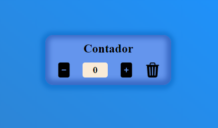

# Contador
 Projeto conta com 3 botões, botão de incremento, decremento e um botao para limpar o campo de exibição.

 [link do projeto](https://contador-nine-phi.vercel.app/)

 Tecnologias usadas nesse projeto:
- HTML
- CSS
- JAVASCRIPT

